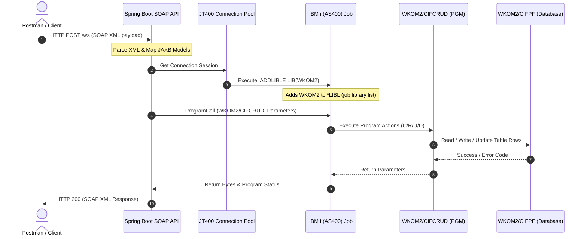

# AS/400 (IBM i) SOAP Web Service CRUD Integration

A premium, enterprise-grade integration system linking a modern **Spring Boot 3 SOAP Web Service** with an **AS/400 (IBM i)** system. The application exposes standard SOAP endpoints for full **Create, Read, Update, and Delete (CRUD)** operations, calling a robust backend **RPGLE program** dynamically over **JT400 (JTOpen)** connection pools to maintain the `CIFPF` customer physical database file.

---

## 🚀 Key Features

*   **Spring Boot 3 SOAP Web Service**: Exposes highly typed WSDL contracts dynamically under `/ws/customers.wsdl`.
*   **Dynamic Library List Integration**: Java dynamically executes `ADDLIBLE LIB(WKOM2)` on JT400 session startup, eliminating hardcoded library qualifiers in RPGLE programs and ensuring smooth implicit file openings.
*   **Highly Structured RPGLE CRUD Backend**: The called program (`CIFCRUD.RPGLE`) monitors conversions, maintains database locks, performs CRUD operations against physical file `WKOM2/CIFPF`, and records audit metrics (Operator, Timestamp).
*   **Robust Error Isolation**: Integrates JAXB models with custom exception mapping, translating AS/400 failures, record locks, or program exception halts into standard XML SOAP Faults.
*   **Postman Automated Assertions**: Includes pre-written JavaScript test scripts inside `testing_scenario.md` to run sequence verification tests automatically.

---

## 🛠️ Architecture & Flow



---

## 💻 Tech Stack

*   **Framework**: Spring Boot 3.x
*   **Web Services**: Spring WS (SOAP 1.1)
*   **Connector**: IBM Toolbox for Java / JT400 (JTOpen 20.x)
*   **XML Binder**: JAXB (Jakarta XML Binding 4.x)
*   **Build Tool**: Apache Maven 3.x
*   **Java Version**: JDK 17
*   **IBM i Language**: RPGLE (IBM Rational Open Access / DB2 for i)

---

## ⚙️ Quick Start

### 1. Compile and Load RPGLE on AS/400
Upload `RPG/cifcrud.rpgle` to your AS/400 source physical file (e.g. `WKOM1/QRPGLESRC`) and compile the program object:
```cmd
CRTBNDRPG PGM(WKOM2/CIFCRUD) SRCFILE(WKOM1/QRPGLESRC) SRCMBR(CIFCRUD) DBGVIEW(*SOURCE)
```

### 2. Configure Spring Boot Application
Update credentials inside **[application.properties](file:///D:/Tutorial/springboot/AS400-SOAP/src/main/resources/application.properties)**:
```properties
as400.host=<YOUR_AS400_HOST>
as400.user=<YOUR_USER>
as400.password=<YOUR_PASSWORD>
as400.library=<YOUR_LIBRARY_NAME>
server.port=8080
```

### 3. Run the Spring Boot App
From the root project directory, run:
```bash
mvn clean spring-boot:run
```
The dynamic contract file (WSDL) will be published at:
`http://localhost:8080/ws/customers.wsdl`

---

## 🧪 Testing the Web Service
Use the highly organized **[testing_scenario.md](file:///D:/Tutorial/springboot/AS400-SOAP/testing_scenario.md)** script to test:
1. **Create Customer** (`CreateCustomerRequest`) - HTTP `POST`
2. **Read Customer** (`GetCustomerRequest`) - HTTP `POST`
3. **Update Customer** (`UpdateCustomerRequest`) - HTTP `POST`
4. **Delete Customer** (`DeleteCustomerRequest`) - HTTP `POST`

---

## 📷 Screen Captures & Proof of Operation

Below are screenshots showing the successful execution of each SOAP operation against the AS/400 database:

### 1. Create a New Customer


### 2. Retrieve Existing Customer


### 3. Update Customer Details


### 4. Verify Updated Details on AS/400


### 5. Delete Customer


### 6. Verify Delete Operation (Not Found)


### 7. Called RPG Program Code


### 8. Verified Created Customer directly in AS/400 (CIFPF file)


### 9. AS/400 Validation Check (Customer Record Detail 1)


### 10. AS/400 Validation Check (Customer Record Detail 2)


### 11. AS/400 Validation Check (Customer Record Detail 3)


